# 수업계획표 도우미 — 사용 안내

이 문서는 **수업계획표 도우미 (Syllabus Companion)** 를 처음 사용하는 선생님을 위한 단계별 안내입니다.  
클래스 캘린더(Class Calendar Multi User)에서 교재·커리큘럼을 가져와 **진도표**를 만들고, 인쇄한 뒤 다시 클래스 캘린더로보내는 방법까지 설명합니다.

> **중요:** `index.html` 파일을 더블클릭해서 열면 안 됩니다. 반드시 **http://localhost:8090** 주소로 접속해야 버튼과 저장 기능이 정상 작동합니다.

---

## 0부. 시작하기

### 0-1. 프로그램 실행

**목표:** 수업계획표 도우미를 컴퓨터에서 실행합니다.

1. 프로젝트 폴더에서 **START COMPANION.bat** 파일을 더블클릭합니다.
2. 검은 창(터미널)이 잠깐 열리고, 곧 웹 브라우저가 자동으로 열립니다.
3. 주소창에 `http://localhost:8090` 이 보이면 성공입니다.

**다른 방법 (터미널 사용):**

```text
npm run sync:ccmu
npm start
```

그다음 브라우저에서 http://localhost:8090 을 엽니다.

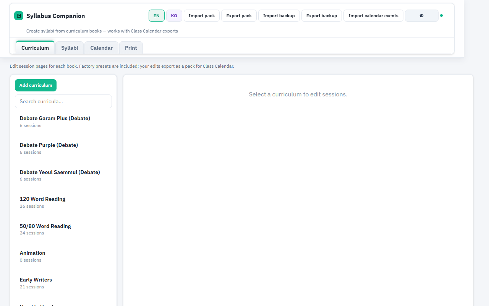

**정상일 때:** 커리큘럼 탭이 보이고, 왼쪽에 교재 목록이 나타납니다.

**자주 하는 실수:** `index.html`을 직접 열면 화면은 보여도 기능이 동작하지 않을 수 있습니다.

---

### 0-2. 한국어로 바꾸기

**목표:** 화면 글자를 한국어로 표시합니다.

1. 화면 오른쪽 위 **KO** 버튼을 클릭합니다.
2. 제목이 **수업계획표 도우미** 로 바뀌면 성공입니다.

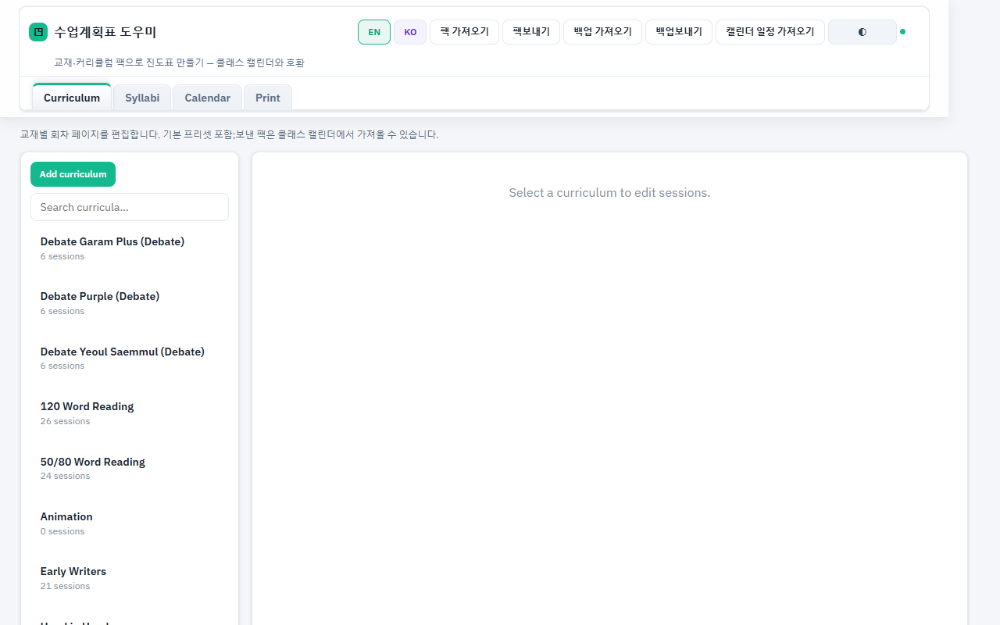

---

### 0-3. 상단 메뉴 이해하기

**목표:** 자주 쓰는 버튼 위치를 익힙니다.

상단 오른쪽에는 다음 버튼이 있습니다.

- **팩 가져오기** — 클래스 캘린더에서보낸 교재·커리큘럼 파일 불러오기
- **팩보내기** — 편집한 커리큘럼을 클래스 캘린더로보내기
- **백업 가져오기 / 백업보내기** — 전체 작업 저장·복원
- **캘린더 일정 가져오기** — 클래스 캘린더의 일정 파일 불러오기

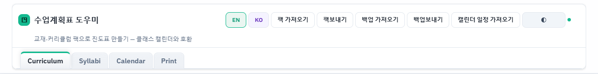

---

### 0-4. 네 개의 탭

**목표:** 앱의 주요 작업 영역을 구분합니다.

상단 탭 네 개를 기억하세요.

| 탭 | 하는 일 |
|----|---------|
| **커리큘럼** | 교재별 회차·페이지 편집 |
| **진도표** | 학급별 진도표 만들기 |
| **캘린더** | 휴일·평가일 등 일정 관리 |
| **인쇄** | A4 진도표 미리보기 및 인쇄 |


탭 순서는 끌어서 바꿀 수 있습니다.

---

## 1부. 클래스 캘린더에서 가져와 진도표 만들기 (가장 많이 쓰는 방법)

### 1-1. 클래스 캘린더에서 팩보내기

**목표:** 클래스 캘린더에 있는 교재·수업 계획 데이터를 파일로 저장합니다.

1. **Class Calendar Multi User** 프로그램을 엽니다.
2. **Data** 탭으로 이동합니다.
3. **Export lesson plans/books pack** (또는 비슷한 이름의보내기 버튼)을 클릭합니다.
4. `.json` 파일이 컴퓨터에 저장됩니다. 파일 위치를 기억해 두세요.

> 이 단계는 클래스 캘린더 프로그램 안에서 진행합니다. 수업계획표 도우미 화면 캡처는 없습니다.

---

### 1-2. 팩 가져오기

**목표:** 방금보낸 JSON 파일을 수업계획표 도우미에 불러옵니다.

1. 수업계획표 도우미 상단 **팩 가져오기** 버튼을 클릭합니다.
2. 파일 선택 창에서 클래스 캘린더에서 저장한 `.json` 파일을 고릅니다.
3. 상단에 **팩 가져옴: 템플릿 …개, 교재 …개** 메시지가 잠깐 나타나면 성공입니다.

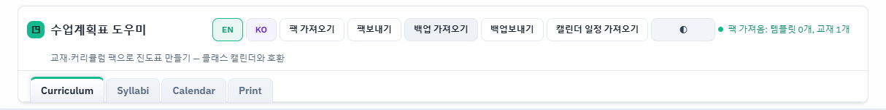

**자주 하는 실수:** JSON이 아닌 다른 파일을 선택하면 **올바른 수업 계획·교재 팩이 아닙니다** 라는 알림이 뜹니다.

---

### 1-3. 커리큘럼 확인

**목표:** 가져온 교재가 목록에 있는지 확인합니다.

1. **커리큘럼** 탭을 클릭합니다.
2. 왼쪽 목록에서 가져온 교재 이름을 클릭합니다.
3. 오른쪽에 회차·페이지 편집 화면이 나타나면 성공입니다.

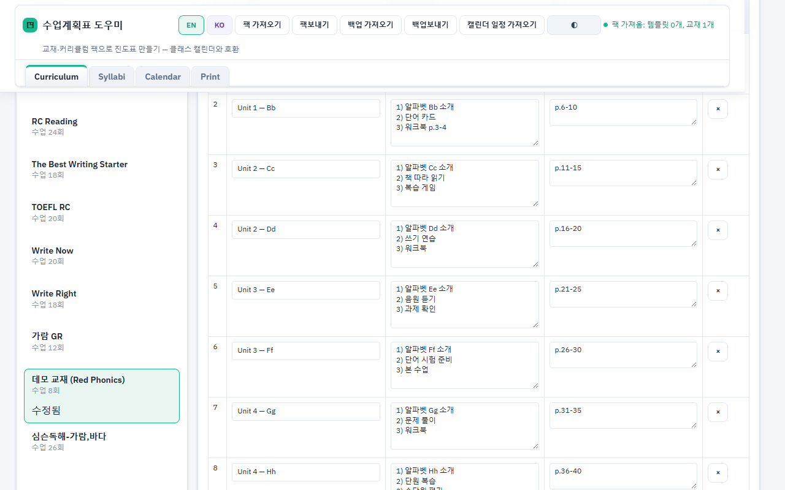

---

### 1-4. 새 진도표 만들기

**목표:** 학급용 진도표 프로젝트를 하나 만듭니다.

1. **진도표** 탭을 클릭합니다.
2. 왼쪽 **새 진도표** 버튼을 클릭합니다.
3. 오른쪽에 빈 설정 양식이 나타납니다.

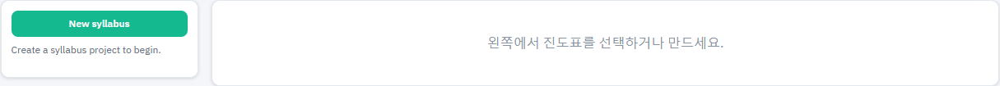

---

### 1-5. 진도표 정보 입력

**목표:** 학급·날짜·수업 요일을 설정합니다.

오른쪽 양식에서 다음 항목을 채웁니다.

1. **진도표 이름** — 예: `초3 Red — 월수금`
2. **커리큘럼 교재** — 가져온 교재 선택
3. **시작일** — 학기 시작 날짜
4. **개월 수로 자동** — 보통 3개월 등 학기 길이 선택
5. **수업 요일** — 예: **월 / 수 / 금**, **주당 수업 횟수** 2회
6. (선택) **학년**, **레벨**, **교시** 등

입력은 자동 저장됩니다. 상단에 **저장됨** 이 보이면 괜찮습니다.

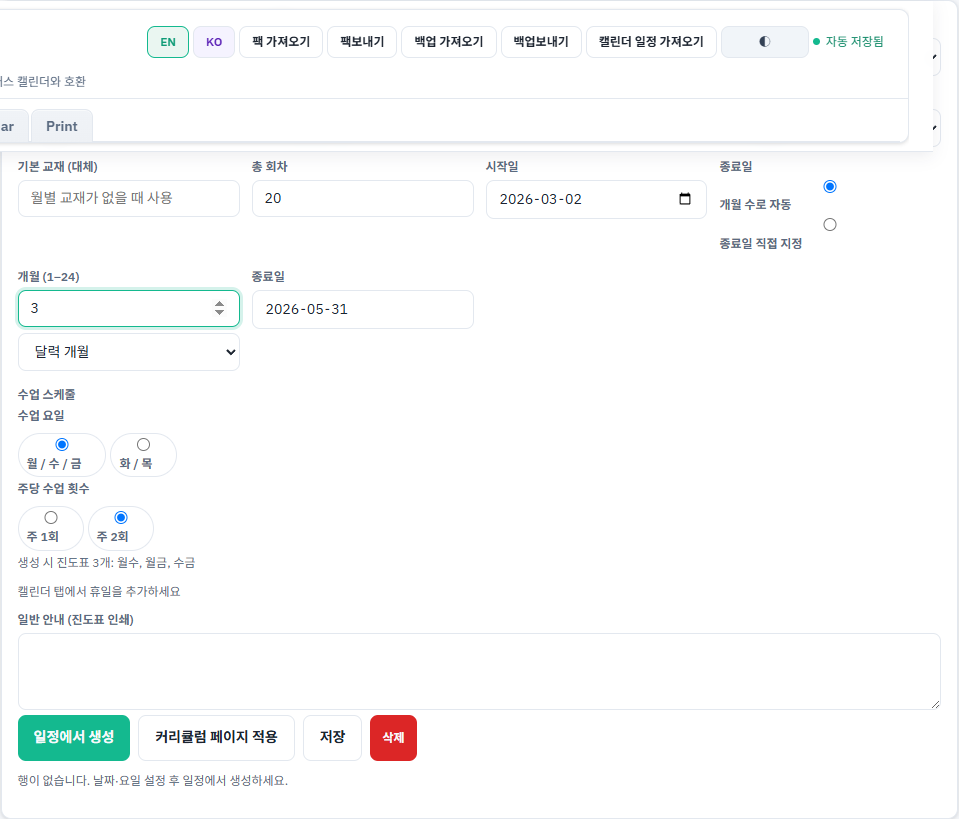

---

### 1-6. 일정에서 생성

**목표:** 날짜와 수업 요일에 맞춰 표 행(주·회차)을 자동으로 만듭니다.

1. 양식 아래 **일정에서 생성** 버튼을 클릭합니다.
2. 표에 **주**, **회차** 열이 채워지면 성공입니다.

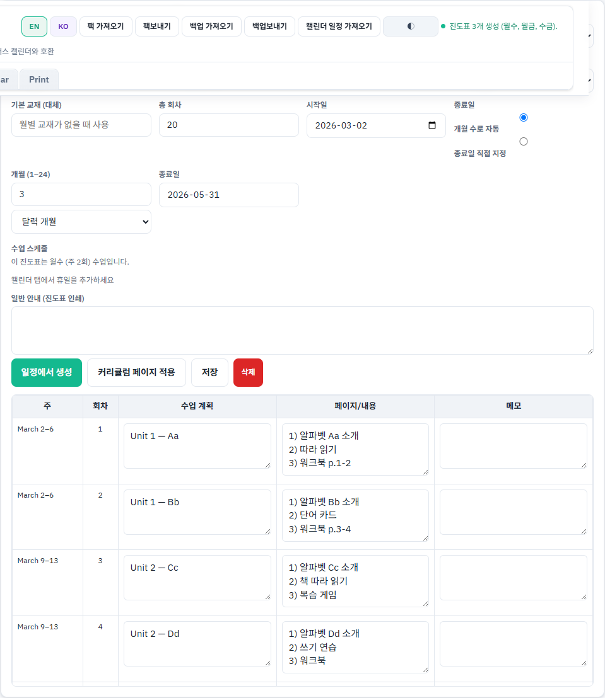

**자주 하는 실수:** 시작일·수업 요일을 비워 두면 행이 생기지 않거나 적게 생깁니다.

---

### 1-7. 커리큘럼 페이지 적용

**목표:** 각 회차에 수업 계획 글과 페이지 번호를 채웁니다.

1. **커리큘럼 페이지 적용** 버튼을 클릭합니다.
2. **수업 계획**, **페이지/내용** 열에 교재 내용이 들어가면 성공입니다.

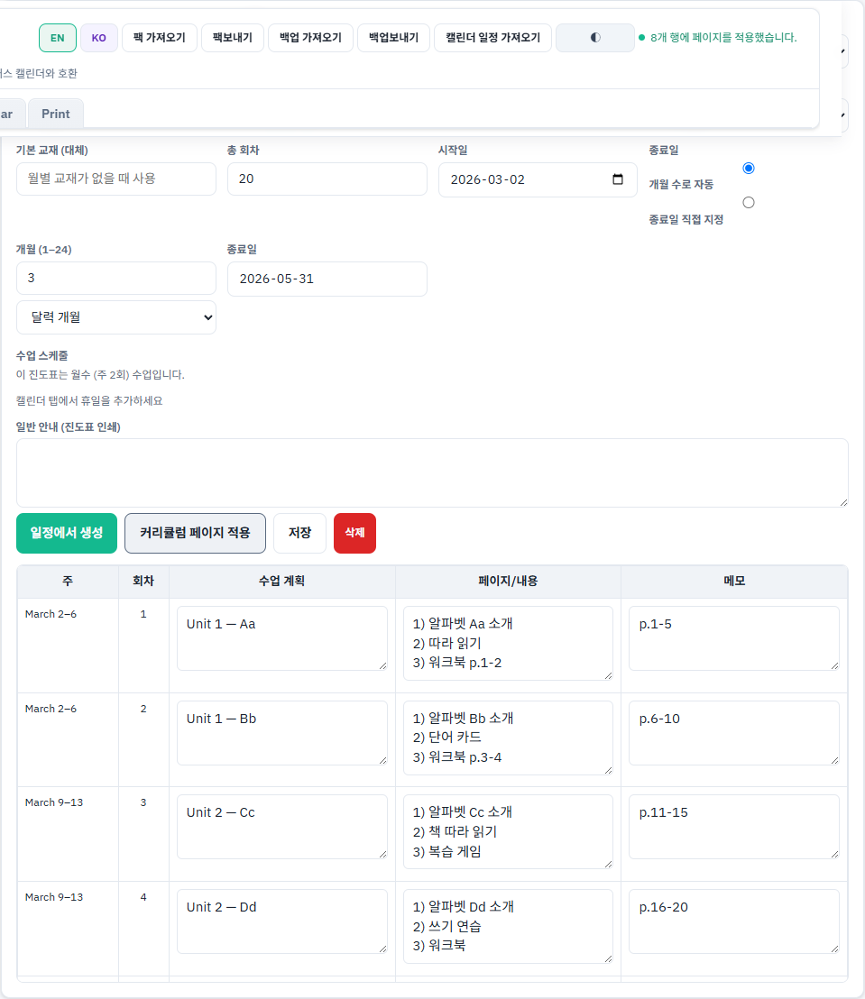

표 안 글자는 직접 수정할 수 있습니다.

---

### 1-8. 인쇄

**목표:** A4 진도표를 미리 보고 인쇄합니다.

1. **인쇄** 탭을 클릭합니다.
2. 인쇄할 진도표에 체크합니다. (**전체 선택** 버튼도 있습니다.)
3. 아래 미리보기에서 내용을 확인합니다.
4. **선택 인쇄** 버튼을 클릭하면 브라우저 인쇄 창이 열립니다.

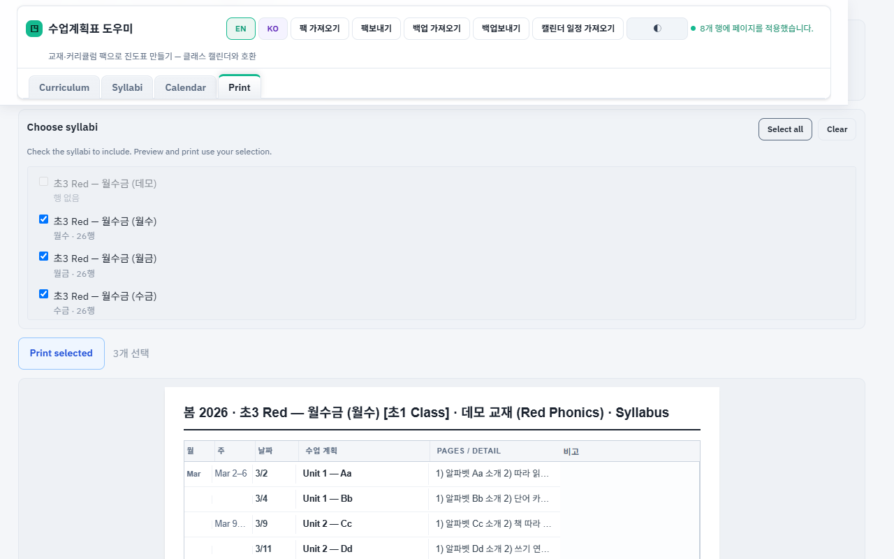

**인쇄 옵션:**

- **날짜 열 표시** — 각 수업 날짜 표시 여부
- **주 열 형식** — 날짜 범위 또는 W1, W2 형식
- **숙제 상세 페이지 (부록)** — 필요할 때만 체크

**자주 하는 실수:** 표에 행이 없으면 인쇄할 내용이 없습니다. 먼저 **1-6 일정에서 생성**을 실행하세요.

---

### 1-9. 클래스 캘린더로 다시보내기

**목표:** 편집한 커리큘럼을 클래스 캘린더에 반영합니다.

1. 상단 **팩보내기** 버튼을 클릭합니다.
2. `.json` 파일이 다운로드됩니다.
3. 클래스 캘린더 → **Data** 탭 → 팩 가져오기(Import)로 그 파일을 불러옵니다.

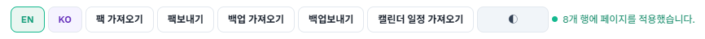

---

## 2부. 여기서 커리큘럼 직접 만들기

클래스 캘린더 없이 이 프로그램에서 교재를 새로 만들 수도 있습니다.

### 2-1. 커리큘럼 추가

**목표:** 새 교재(커리큘럼)를 만듭니다.

1. **커리큘럼** 탭으로 이동합니다.
2. **커리큘럼 추가** 버튼을 클릭합니다.
3. 이름 입력 창에 교재 이름을 입력하고 확인합니다. (예: `Red Phonics 2026`)

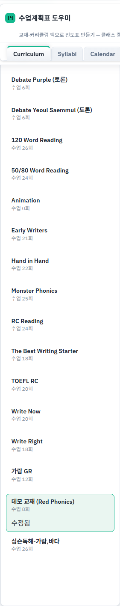

---

### 2-2. 회차·페이지 편집

**목표:** 각 수업 회차의 계획과 페이지를 입력합니다.

1. 왼쪽 목록에서 방금 만든 교재를 클릭합니다.
2. 오른쪽 편집기에서 회차별 **수업 계획**, **페이지** 등을 입력합니다.
3. 변경 사항은 자동 저장됩니다.

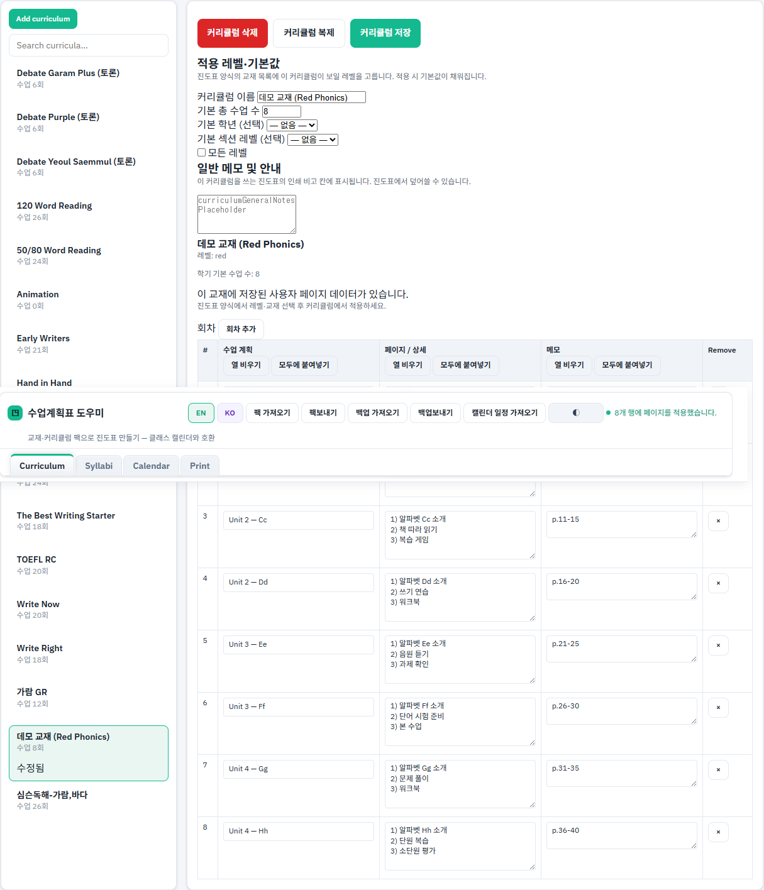

---

### 2-3. 진도표 만들기

**목표:** 만든 교재로 진도표를 완성합니다.

**진도표** 탭에서 새 진도표를 만들거나 마법사를 사용합니다. 마법사는 **빈 진도표**만 만들고, 편집 화면에서 **일정에서 생성** → **커리큘럼 페이지 적용** → **인쇄** 순서로 진행하세요. 비슷한 수업(예: 화·목)은 **복제**한 뒤 요일·이름만 바꿉니다.

---

## 3부. 캘린더와 휴일

휴일과 평가일을 넣으면 **일정에서 생성**할 때 수업이 없는 날을 자동으로 건너뜁니다. 캘린더의 수업 막대는 **선택된(활성) 진도표**의 예정 수업일만 표시합니다(시작–종료·수업 요일, 휴일 제외 — Class Calendar와 같은 규칙).

### 3-1. 캘린더 기간 설정

**목표:** 캘린더에 표시할 날짜 범위를 정합니다.

1. **캘린더** 탭을 클릭합니다.
2. **표시 시작**, **표시 종료** 날짜를 입력합니다.
3. **모든 진도표에 맞춤** 버튼을 누르면 진도표 날짜에 맞게 자동으로 채워집니다.

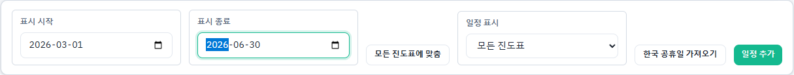

---

### 3-2. 한국 공휴일 가져오기

**목표:** 한국 공휴일을 자동으로 캘린더에 넣습니다.

1. **한국 공휴일 가져오기** 버튼을 클릭합니다.
2. 인터넷 연결이 필요합니다. 잠시 후 캘린더에 공휴일이 표시됩니다.

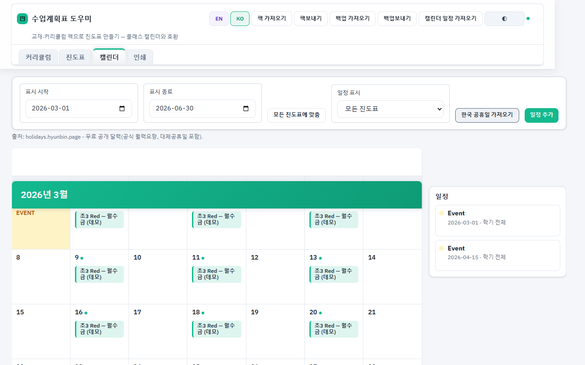

---

### 3-3. 일정 추가

**목표:** 평가일, 숙제 마감일 등 직접 일정을 넣습니다.

1. **일정 추가** 버튼을 클릭하거나, 캘린더에서 날짜를 클릭합니다.
2. 창에서 종류(휴일, 평가 기간 등), 제목, 날짜를 입력합니다.
3. **저장**을 클릭합니다.

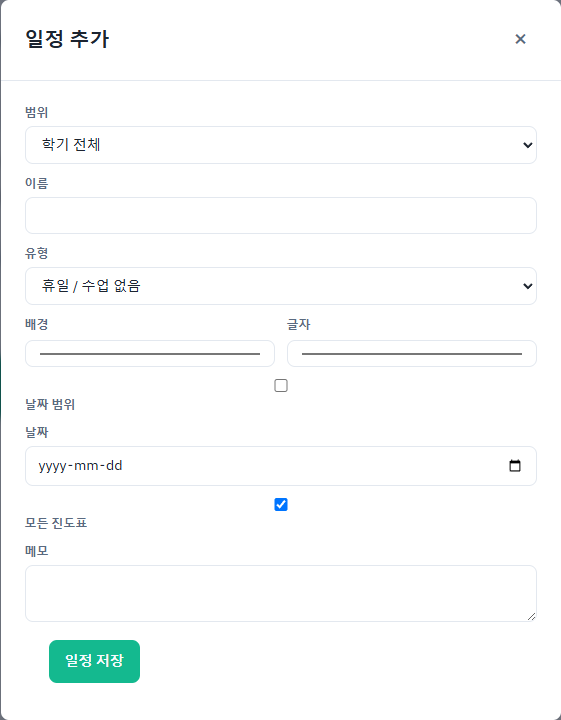

**참고:** **일정 표시** 드롭다운에서 **모든 진도표** 또는 **선택한 진도표만** 고를 수 있습니다.

---

### 3-4. 진도표와 연결

캘린더에 넣은 휴일·일정은 **진도표** 탭에서 **일정에서 생성**할 때 반영됩니다.  
공휴일이 있는 날에는 수업 회차가 잡히지 않습니다.

---

## 4부. 백업과 데이터 안전

### 4-1. 백업보내기

**목표:** 모든 진도표·커리큘럼 편집 내용을 파일로 저장합니다.

1. 상단 **백업보내기** 버튼을 클릭합니다.
2. `syllabus-companion-backup_날짜.json` 파일이 저장됩니다.
3. 이 파일을 USB나 클라우드에 보관하세요.


---

### 4-2. 백업 가져오기

**목표:** 다른 컴퓨터나 브라우저에서 작업을 이어갑니다.

1. **백업 가져오기** 버튼을 클릭합니다.
2. 이전에 저장한 백업 `.json` 파일을 선택합니다.
3. 진도표와 커리큘럼이 복원됩니다.

---

### 4-3. localStorage 안내

작업 내용은 **이 컴퓨터의 이 브라우저** 안에만 저장됩니다 (localStorage).

- 브라우저 데이터를 지우면 작업이 사라질 수 있습니다.
- 다른 PC에서 쓰려면 **백업보내기 / 백업 가져오기**를 사용하세요.
- 커리큘럼만 클래스 캘린더와 주고받을 때는 **팩보내기 / 팩 가져오기**를 사용하세요.

| 기능 | 저장 범위 |
|------|-----------|
| **백업보내기** | 진도표 + 캘린더 일정 + 커리큘럼 편집 전체 |
| **팩보내기** | 커리큘럼·교재만 (클래스 캘린더 호환) |

---

## 5부. 문제 해결 (FAQ)

### 화면이 비어 있거나 버튼이 안 됩니다

- 주소가 **http://localhost:8090** 인지 확인하세요.
- `index.html`을 직접 연 경우 서버를 끄고 **START COMPANION.bat**으로 다시 실행하세요.

### 클래스 캘린더를 업데이트한 뒤 이상합니다

터미널에서 다음을 실행한 뒤, 브라우저에서 **Ctrl+F5** (강력 새로고침)를 누르세요.

```text
npm run sync:ccmu
```

### 인쇄할 행이 없습니다

1. **진도표** 탭에서 프로젝트를 선택했는지 확인합니다.
2. **일정에서 생성**을 먼저 실행했는지 확인합니다.
3. **인쇄** 탭에서 해당 진도표에 체크했는지 확인합니다.

### 팩 가져오기가 실패합니다

- 클래스 캘린더 **Data** 탭에서보낸 **lesson plans/books pack** JSON인지 확인합니다.
- 파일이 손상되지 않았는지 확인합니다.

### 한국어 공휴일이 안 불러와집니다

- 인터넷 연결을 확인합니다.
- 실패하면 **일정 추가**로 휴일을 직접 입력할 수 있습니다.

---

## 빠른 요약 (한 장)

1. **START COMPANION.bat** 실행 → http://localhost:8090
2. **KO** 로 한국어 전환
3. 클래스 캘린더에서 팩보내기 → **팩 가져오기**
4. **진도표** → **새 진도표** → 정보 입력
5. **일정에서 생성** → **커리큘럼 페이지 적용**
6. **인쇄** 탭에서 인쇄
7. **팩보내기** 또는 **백업보내기**로 파일 저장

---

*문서 버전: 2026년 3월 | 수업계획표 도우미 (Simple Syllabus Companion Tool)*
